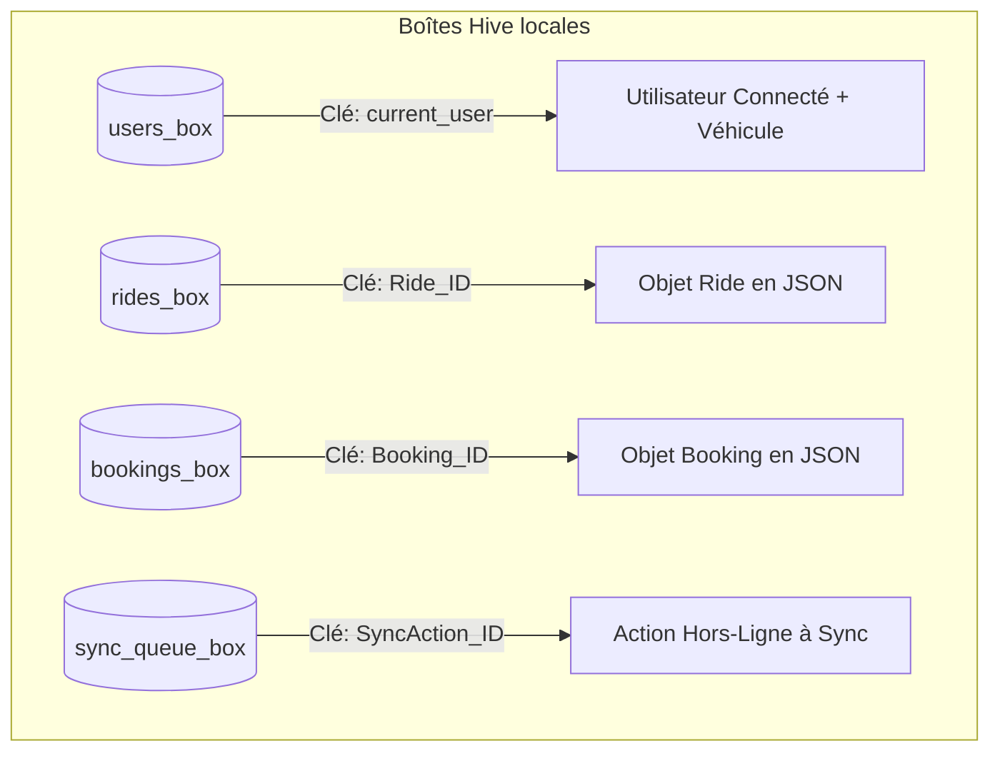
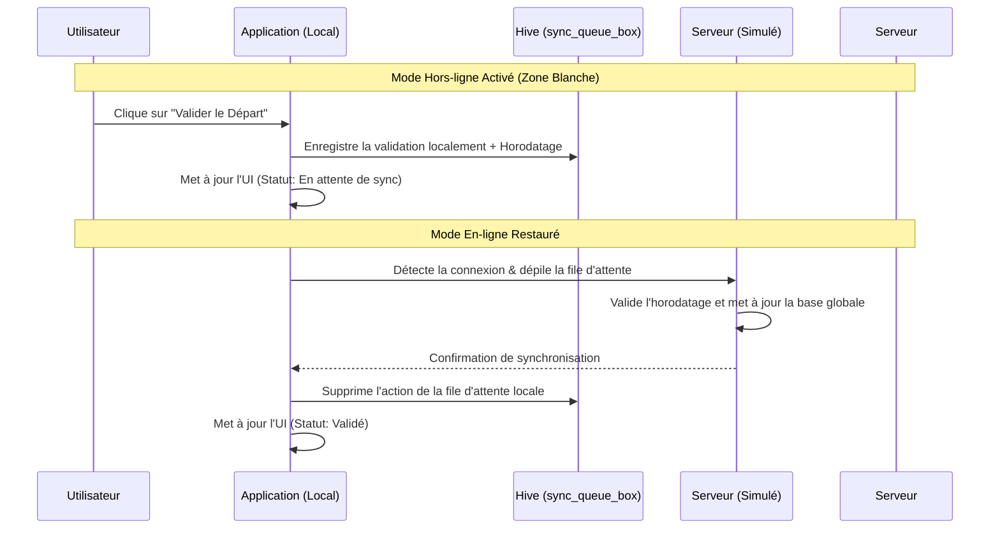

# Rapport Technique : Architecture & Persistance
## Projet : Plateforme de Covoiturage Communautaire
### Auteur : Antigravity Coding Assistant
---

## 1. Choix d'Architecture Logicielle

L'application a été structurée selon les principes d'une architecture propre (Clean Architecture) simplifiée et réactive, particulièrement adaptée aux applications Flutter modernes de taille moyenne à grande.

### 1.1 Gestion d'État avec Riverpod
Pour la gestion d'état globale de l'application, nous avons sélectionné **Flutter Riverpod (v2.6.x)** comme alternative moderne à Provider et BLoC.
* **Sécurité de Compilation (Compile-time Safety)** : Contrairement à Provider, Riverpod attrape les erreurs de dépendance manquante à la compilation plutôt qu'au moment de l'exécution.
* **Aucune Dépendance envers le BuildContext** : Riverpod permet d'accéder aux providers n'importe où (notamment dans la file d'attente de synchronisation en arrière-plan) sans nécessiter de contexte widget.
* **Gestion Recommandée par Google & la Communauté** : Il s'intègre parfaitement avec les flux asynchrones complexes (chargement de Hive, notifications réseau, etc.).

Dans ce projet, nous utilisons :
* `StateNotifierProvider` : Pour modéliser les machines à état complexes comme la gestion des réservations (`BookingNotifier`) ou la publication de trajets (`RideListNotifier`).
* `StateProvider` / `StateNotifier` simple : Pour simuler le statut du réseau (`NetworkStatusNotifier`) et piloter dynamiquement les widgets d'information.

### 1.2 Organisation des Dossiers (Structure du Projet)
```text
lib/
├── main.dart                 # Point d'entrée de l'application, configuration du thème sombre & router
├── models/
│   └── models.dart           # Modèles de données (User, Vehicle, Ride, Booking, SyncAction)
├── providers/
│   └── state_providers.dart  # Centralisation des états globaux et de la file de synchronisation
├── widgets/
│   ├── glass_container.dart  # Composant UI Glassmorphic réutilisable
│   └── network_banner.dart   # Bandeau de contrôle et simulateur réseau
└── screens/
    ├── onboarding_screen.dart # Écran d'inscription et de vérification d'email
    ├── driver_portal.dart     # Gestion véhicule conducteur & publication de trajets
    ├── passenger_search.dart  # Recherche multicritères avec filtres avancés
    ├── ride_details_screen.dart # Détails et Feuille de Route embarquée
    └── carnet_voyage_screen.dart # Carnet de voyage hors-ligne (Checkpoints Départ/Arrivée)
```

---

## 2. Structure de la Base de Données Locale & Persistance (Hive)

Le stockage hors-ligne est la fonctionnalité clé de l'application pour répondre au problème des zones blanches (zones sans réseau routier).

### 2.1 Pourquoi Hive ?
Nous avons choisi **Hive** (`hive_flutter`) pour la persistance locale :
1. **Performance Légendaire** : Hive est une base de données clé-valeur écrite en Dart pur. Ses performances en lecture/écriture dépassent largement celles de SQLite (`sqflite`) ou SharedPreferences.
2. **Aucune Dépendance Native Complexe** : Contrairement aux bases SQL traditionnelles, Hive ne nécessite pas de compilation binaire lourde par plateforme, ce qui élimine les risques d'erreurs de build.
3. **Persistance sans Code Generation (No-codegen)** : Plutôt que de générer de longs fichiers d'adaptateurs via `build_runner` (qui peuvent poser des problèmes de compatibilité), nous avons opté pour une approche moderne et sûre : la sérialisation en documents JSON stockés sous forme de chaînes de caractères chiffrées dans des boîtes (Boxes).

### 2.2 Schéma de Stockage des Données
Les données sont réparties dans 4 boîtes Hive distinctes :



#### A. `users_box`
Stocke les détails de profil de l'utilisateur actif.
* Clé `'current_user'` : JSON String représentant le modèle `User` (ID, Nom, Email, Cercle communautaire, Badge vérifié).
* Clé `'driver_vehicle'` : JSON String représentant le modèle `Vehicle` (Modèle, Couleur, Catégorie, Immatriculation, Nombre de places).

#### B. `rides_box`
Stocke tous les trajets disponibles.
* Clé `rideId` : JSON String de l'objet `Ride`. Permet de précharger et rechercher des trajets même hors-ligne.

#### C. `bookings_box`
Stocke les réservations effectuées.
* Clé `bookingId` : JSON String de l'objet `Booking` (contenant le trajet, le passager et les états de validation Départ/Arrivée). C'est ce fichier qui fait office de **Feuille de Route Embarquée**.

#### D. `sync_queue_box`
Stocke la file d'attente des validations Départ et Arrivée émises en zone blanche (Hors-ligne).
* Clé `syncActionId` : JSON String représentant l'action (`SyncAction`) contenant :
  - `actionType` : `'VALIDATE_DEPARTURE'` ou `'VALIDATE_ARRIVAL'`
  - `bookingId` : Identifiant de la réservation concernée
  - `timestamp` : Date et heure de l'action utilisateur hors-ligne

---

## 3. Logique de Synchronisation & Mode Hors-ligne (Mécanique Anti-fraude)

La validation hors-ligne et la synchronisation lors de la reconnexion réseau sont gérées par la classe `SyncQueueNotifier` :



1. **Enregistrement Local** : Quand le passager ou le conducteur valide le départ/arrivée hors-ligne, le statut local de la réservation dans `bookings_box` passe immédiatement à `true` avec un indicateur visuel orange "En attente de synchronisation ⏳". L'heure exacte de l'action est enregistrée dans le champ `offlineActionTimestamp`.
2. **File d'Attente** : Une entrée `SyncAction` est ajoutée dans `sync_queue_box`.
3. **Détection Réseau & Flush** : Dès que l'application détecte un retour au statut En ligne (via le `NetworkStatusNotifier`), le service de synchronisation envoie automatiquement toutes les requêtes en attente vers le serveur simulé.
4. **Anti-fraude** : L'utilisation de l'horodatage initial (`offlineActionTimestamp`) permet au serveur de vérifier que l'action a bien eu lieu au bon moment de la course et non pas reconstituée a posteriori, empêchant les conducteurs malveillants de valider des trajets fictifs une fois revenus en zone couverte.

---

## 4. Choix Graphiques & Expérience Utilisateur Premium

Pour offrir un design fluide et moderne à la hauteur des outils professionnels Google, nous avons implémenté les techniques esthétiques suivantes :

* **Glassmorphism (Effet Verre Dépoli)** : Réalisé grâce au widget personnalisé `GlassContainer` combinant `BackdropFilter` (floutage de l'arrière-plan avec un `sigma` de 12.0) et des gradients semi-transparents avec bordures ultra-fines d'opacité `0.15`.
* **Thème Sombre Premium** : Utilisation d'un fond violet très sombre (`0xFF0F0B1E`) combiné à des accents néons cyan fluorescent (`Colors.cyanAccent`) et des dégradés violets (`Colors.deepPurpleAccent`), créant de la profondeur et un sentiment haut de gamme.
* **Formes & Contours Arrondis** : Utilisation systématique de rayons de bordure compris entre `16.0` et `24.0` pixels sur tous les conteneurs, boutons, champs de saisie et cartes, en phase avec les directives actuelles du Material 3 de Google.
* **Micro-animations & Retours Visuels** :
  - Transition de couleur animée sur le voyant de statut réseau.
  - Animations lors du passage en mode hors-ligne pour alerter l'utilisateur de manière rassurante.
  - Profil d'utilisateur accessible via un composant animé Hero.
